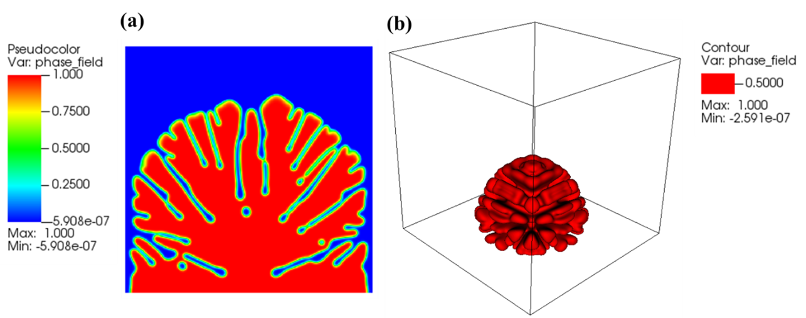
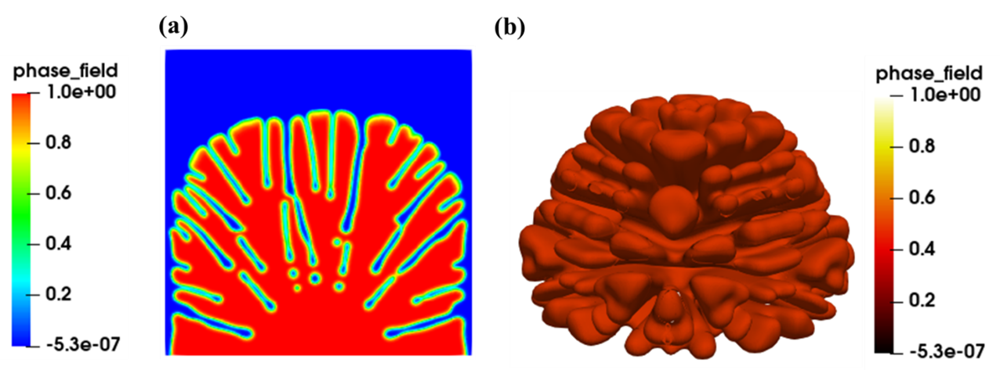
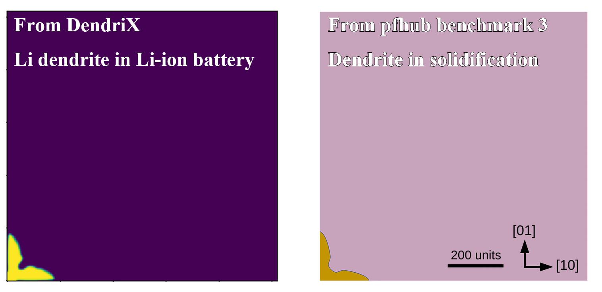
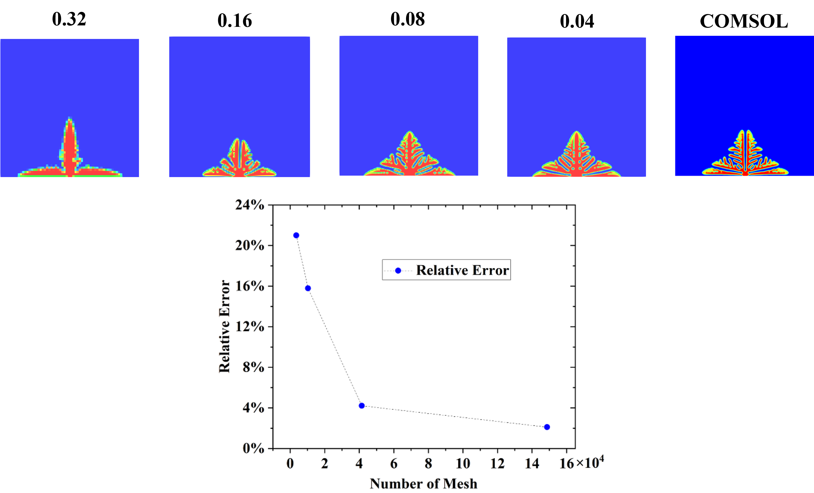

# DendriX

**DendriX** is an open-source scientific software platform for simulating
two-dimensional (2D) and three-dimensional (3D) lithium dendrite growth in
Li-ion batteries using a phase-field–based multiphysics framework.
The software integrates **adaptive mesh refinement (AMR)**, **finite volume
discretization**, **implicit solvers**, and **hybrid MPI–OpenMP parallelization**
to efficiently solve strongly coupled nonlinear governing equations.

DendriX is designed as a flexible, maintainable, and extendable alternative
to commercial multiphysics software such as COMSOL and MOOSE, with a particular
strength in scalable 3D simulations.

The software is released under the **GNU General Public License v3.0 (GPL-3.0)**.

---
## Tested Build Environments

| Operating System | Compiler | MPI | Result |
|------------------|--------|----|------|
| Ubuntu 20.04 | gfortran 9.4 | OpenMPI | success |
| Ubuntu 22.04 | gfortran 11.4 | OpenMPI | success |
| Linux HPC (UMich ARC-TS) | GCC 8.2 | OpenMPI 3.1.6 | success |
| Linux HPC (UMich ARC-TS) | Intel 2022 | Intel MPI 2021 | success |
| Linux (local build) | gfortran | MPICH | success |
DendriX is compatible with multiple MPI implementations (OpenMPI, Intel MPI, and MPICH) and supports both GNU and Intel compiler toolchains on workstation and HPC systems.

## Quick Start

This section provides the minimum steps required to **build, run, and visualize**
a DendriX simulation.

### Prerequisites
- Linux-based system
- GNU Fortran or Intel Fortran compiler
- MPI library (optional, for parallel runs)
- VisIt or ParaView for visualization

### Build
```bash
cd PhaseField/Works/Dendrite_PFcode
make
```

Enable MPI:
```bash
make MPI=t
```

Enable OpenMP (recommended for 3D):
```bash
make OMP=t
```

### Run

Serial (2D example):
```bash
./main.Linux.gfortran.exe Inputs_2d seed_def
```

Parallel (3D example):
```bash
mpirun -n 4 ./main.Linux.gfortran.mpi.exe Inputs_3d seed_def
```

### Visualize

**VisIt**
1. Open VisIt
2. Load `den00000000/Header`
3. Add *Pseudocolor → phase_field* (2D) or *Contour → phase_field* (3D)
4. Click **Draw**

**ParaView**
1. Open a plotfile directory (e.g., `den00096000`)
2. Select *AMReX / BoxLib Grid Reader*
3. Choose `phase_field` and click **Apply**
4. (3D) Apply *Contour* filter (e.g., isovalue = 0.5)

---

## Example Visualization Results

Below are representative visualization outputs generated using **VisIt** and **ParaView**.

### Figure 1. Visualization generated using VisIt
<p align="center">
   
</p>

### Figure 2. Visualization generated using ParaView
<p align="center">
   
</p>

---


## Benchmark with PFHub

Note: The governing equations, source terms, and driving mechanisms differ fundamentally.

### Figure 3. Exploratory simulations to compare qualitative morphological features under similar anisotropic interface conditions
<p align="center">
   
</p>

---


## Mesh convergence study

### Figure 4. Mesh convergence study as compared with COMSOL
<p align="center">
   
</p>

---

## Software Capabilities

- Simulation of **2D and 3D Li-ion dendrite growth**
- Single-dendrite and multi-dendrite configurations
- **Adaptive mesh refinement (AMR)**
- Multiple numerical solution strategies
- Serial and **MPI/OpenMP parallel execution**
- Visualization using **VisIt** and **ParaView**

---

## Directory Structure

```
PhaseField/
├── Src/
├── Tools/
└── Works/
    └── Dendrite_PFcode/
```

---

## License

This project is licensed under the **GNU General Public License v3.0 (GPL-3.0)**.
See the `LICENSE` file for details.

---
## Third-Party Software

This project incorporates portions of the BoxLib adaptive mesh refinement (AMR) framework developed by Lawrence Berkeley National Laboratory (LBNL).

BoxLib is redistributed under the BSD-3-Clause license.  
The original license text is provided in `LICENSE`.

Only infrastructure components (mesh management, parallel communication, and AMR utilities) originate from BoxLib.  
All electrochemical phase-field models, solvers, and application modules are original developments of the DendriX project and are released under GPL-3.0.

---

**DOI:** https://doi.org/10.5281/zenodo.18181222

## Citation

If you use DendriX in your research, please cite:

> wh. Yang et al., *DendriX: A Flexible, Maintainable, and Extendable Platform to
> Simulate 3D Li-Dendrite Growth*, SoftwareX, 2026.

---

## Contact

For questions or issues, please open an issue on GitHub.
